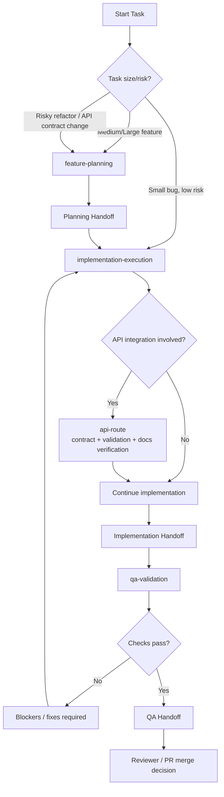

# Project Skills

These project-local skills standardize repeatable delivery patterns.

- `next-feature`: implement product features in app router architecture
- `api-route`: create robust API routes with validation and tests
- `test-coverage`: expand tests and prevent regressions
- `perf-check`: investigate and improve runtime bottlenecks (production-mode first)
- `feature-planning`: define scope, acceptance criteria, risks, and test strategy before coding
- `implementation-execution`: implement approved plans with focused, standards-aligned changes
- `qa-validation`: verify behavior, run quality gates, and report merge readiness

## Default Agent Order

1. `feature-planning`
2. `implementation-execution`
3. `qa-validation`

## Rule of Thumb

- Small bug fix (single-file or low-risk): `implementation-execution` -> `qa-validation`
- Medium/large feature: `feature-planning` -> `implementation-execution` -> `qa-validation`
- Risky refactor or API contract change: always run all three in order

## Copy-Paste Prompts

`feature-planning`
```text
Use the feature-planning skill.
Task: <describe the feature or change>
Constraints: <technical, product, or timeline constraints>
Output:
- scope and non-goals
- acceptance criteria
- file-by-file implementation plan
- risks and rollback plan
- test strategy (unit/integration/e2e)
Do not implement yet.
```

`implementation-execution`
```text
Use the implementation-execution skill.
Implement the approved plan for: <task>.
Follow project standards and keep changes focused.
Run typecheck and relevant tests before handoff; run lint when lint setup is functional.
Report:
- files changed
- key implementation decisions
- any follow-up items
```

`api-route`
```text
Use the api-route skill.
Task: <describe the API route to add/update>
If integrating an external provider, verify latest docs before implementation:
- endpoint URL, method, headers, auth
- request/response schema
- rate limits and error codes
Implement route in src/app/api with validation and focused module boundaries.
Run typecheck and relevant tests before handoff; run lint when lint setup is functional.
Report:
- API contract and status codes
- test coverage added (integration + any src/lib unit tests)
- doc URL(s) used for external API verification
```

`qa-validation`
```text
Use the qa-validation skill.
Validate the completed implementation for: <task>.
Check acceptance criteria, edge cases, and regressions.
Run typecheck and relevant tests; run lint when lint setup is functional.
Report:
- blocking issues (if any)
- non-blocking improvements
- merge readiness verdict
```

`perf-check`
```text
Use the perf-check skill.
Target: <page/route/interaction>
Run baseline in production mode (npm run build && npm run start).
Capture cold and warm metrics, identify root cause, and apply only focused optimization.
Re-measure in the same production setup and report before/after.
Use dev mode only as a quick smoke signal.
```

## Example Prompts By Skill

`feature-planning` example
```text
Use the feature-planning skill.
Task: Add profile photo upload on the user profile page.
Constraints: max file size 3MB, JPG/PNG only, no third-party storage in v1.
Output:
- scope and non-goals
- acceptance criteria
- file-by-file implementation plan
- risks and rollback plan
- test strategy (unit/integration/e2e)
Do not implement yet.
```

`implementation-execution` example
```text
Use the implementation-execution skill.
Implement the approved plan for: profile photo upload on /profile.
Follow project standards and keep changes focused.
Run typecheck and relevant tests before handoff; run lint when lint setup is functional.
Report:
- files changed
- key implementation decisions
- any follow-up items
```

`api-route` example
```text
Use the api-route skill.
Task: Add POST /api/profile/avatar to upload and validate profile photo metadata.
If integrating an external provider, verify latest docs before implementation:
- endpoint URL, method, headers, auth
- request/response schema
- rate limits and error codes
Implement route in src/app/api with validation and focused module boundaries.
Run typecheck and relevant tests before handoff; run lint when lint setup is functional.
Report:
- API contract and status codes
- test coverage added (integration + any src/lib unit tests)
- doc URL(s) used for external API verification
```

`qa-validation` example
```text
Use the qa-validation skill.
Validate the completed implementation for: profile photo upload feature.
Check acceptance criteria, edge cases, and regressions.
Run typecheck and relevant tests; run lint when lint setup is functional.
Report:
- blocking issues (if any)
- non-blocking improvements
- merge readiness verdict
```

`perf-check` example
```text
Use the perf-check skill.
Target: /profile page initial load and avatar upload interaction.
Run baseline in production mode (npm run build && npm run start).
Capture cold and warm metrics, identify root cause, and apply only focused optimization.
Re-measure in the same production setup and report before/after.
Use dev mode only as a quick smoke signal.
```

`test-coverage` example
```text
Use the test-coverage skill.
Task: Increase confidence for profile avatar upload changes.
Add unit tests for src/lib validation utilities, integration tests for API success/failure paths,
and e2e coverage for the user-critical upload flow.
Report coverage command and changed-file coverage, or mark n/a with reason.
```

`next-feature` example
```text
Use the next-feature skill.
Task: Add a profile preferences panel with theme and notification toggles.
Implement in src/app and src/components with clear server/client boundaries.
Keep changes focused, update tests for changed behavior, and hand off with decisions and risks.
```

## Workflow Diagram



## Handoff Protocol

Use a handoff at each transition:

- `feature-planning` -> `implementation-execution`
- `implementation-execution` -> `qa-validation`
- `qa-validation` -> reviewer/PR merge decision

Copy-paste handoff block:
```text
Handoff: <planning|implementation|qa>
Task: <feature/bug name>

Completed:
- <what was done>

Files:
- <path1>
- <path2>

Decisions:
- <decision + why>

Checks:
- lint: <pass/fail>
- typecheck: <pass/fail>
- tests: <pass/fail + scope>
- coverage command: <command used or n/a>
- changed files coverage: <percent or n/a>
- critical paths covered: <yes/no + note>

Risks / Follow-ups:
- <item>

Next owner:
- <implementation-execution|qa-validation|reviewer>
```
