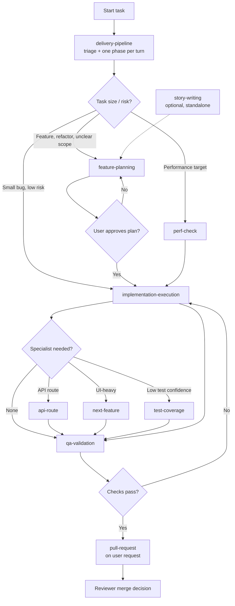

# Project Skills

These project-local skills standardize repeatable delivery patterns.

## Recommended entry point

Start with **`delivery-pipeline`** for any non-trivial task. It triages the request, runs one delivery phase at a time, and stops for your approval before each handoff.

- `delivery-pipeline`: route tasks through plan → implement → QA (one phase per turn)

## Specialized skills

- `next-feature`: implement product features in app router architecture
- `api-route`: create robust API routes with validation and tests
- `test-coverage`: expand tests and prevent regressions
- `perf-check`: investigate and improve runtime bottlenecks (production-mode first)
- `feature-planning`: define scope, acceptance criteria, risks, and test strategy before coding
- `implementation-execution`: implement approved plans with focused, standards-aligned changes
- `qa-validation`: verify behavior, run quality gates, and report merge readiness

## Standalone (not in delivery-pipeline flow)

- `story-writing`: optional product story format — invoke directly, not via `delivery-pipeline`
- `pull-request`: open or update a GitHub PR with structured title, body, and test plan (after QA or on request)

## Skill Role Mapping

- `delivery-pipeline` -> Delivery pipeline lead
- `story-writing` -> Product Story Writer
- `feature-planning` -> Feature Planner
- `implementation-execution` -> Developer
- `next-feature` -> Frontend Developer
- `api-route` -> API Developer
- `test-coverage` -> Test Engineer
- `qa-validation` -> QA Engineer
- `pull-request` -> PR author (post-QA / on request)
- `perf-check` -> Performance Engineer

## Default Agent Order

Use **`delivery-pipeline`** to pick the path below automatically.

1. `feature-planning`
2. `implementation-execution`
3. `qa-validation`

## Rule of Thumb

- Small bug fix (single-file or low-risk): `implementation-execution` -> `qa-validation`
- Medium/large feature or unclear scope: `feature-planning` -> `implementation-execution` -> `qa-validation`
- Risky refactor or API contract change: `feature-planning` -> `implementation-execution` -> `qa-validation`

## Copy-Paste Prompts

`delivery-pipeline`
```text
Use the delivery-pipeline skill.
Task: <describe request>
Constraints: <optional>
Start at the correct phase, run one phase only, then stop for my approval.
```

`story-writing`
```text
Use the story-writing skill.
Task: <describe the feature/request>
Keep output concise and implementation-ready.
Include:
- title and roles
- objective and user story
- in-scope and out-of-scope
- testable acceptance criteria (Given/When/Then)
- dependencies, risks, and assumptions
- short handoff note for feature-planning
```

`feature-planning`
```text
Use the feature-planning skill.
Task: <describe the feature or change>
Constraints: <technical, product, or timeline constraints>
Output:
- scope and non-goals
- acceptance criteria
- file-by-file implementation plan
- risks and rollback plan
- test strategy (unit/integration/e2e)
Do not implement yet.
```

`implementation-execution`
```text
Use the implementation-execution skill.
Implement the approved plan for: <task>.
Follow project standards and keep changes focused.
Run typecheck and relevant tests before handoff; run lint when lint setup is functional.
Report:
- files changed
- key implementation decisions
- any follow-up items
```

`api-route`
```text
Use the api-route skill.
Task: <describe the API route to add/update>
If integrating an external provider, verify latest docs before implementation:
- endpoint URL, method, headers, auth
- request/response schema
- rate limits and error codes
Implement route in src/app/api with validation and focused module boundaries.
Run typecheck and relevant tests before handoff; run lint when lint setup is functional.
Report:
- API contract and status codes
- test coverage added (integration + any src/lib unit tests)
- doc URL(s) used for external API verification
```

`qa-validation`
```text
Use the qa-validation skill.
Validate the completed implementation for: <task>.
Check acceptance criteria, edge cases, and regressions.
Run typecheck and relevant tests; run lint when lint setup is functional.
Report:
- blocking issues (if any)
- non-blocking improvements
- merge readiness verdict
```

`perf-check`
```text
Use the perf-check skill.
Target: <page/route/interaction>
Run baseline in production mode (npm run build && npm run start).
Capture cold and warm metrics, identify root cause, and apply only focused optimization.
Re-measure in the same production setup and report before/after.
Use dev mode only as a quick smoke signal.
```

## Example Prompts By Skill

`delivery-pipeline` example
```text
Use the delivery-pipeline skill.
Task: Add saved address sync with the WooCommerce store on the account addresses page.
Constraints: must work with existing user-context sync; no breaking checkout.
Start at the correct phase, run one phase only, then stop for my approval.
```

`story-writing` example
```text
Use the story-writing skill.
Task: Add profile photo upload for signed-in users.
Keep output concise and implementation-ready.
Include:
- title and roles
- objective and user story
- in-scope and out-of-scope
- testable acceptance criteria (Given/When/Then)
- dependencies, risks, and assumptions
- short handoff note for feature-planning
```

`feature-planning` example
```text
Use the feature-planning skill.
Task: Add profile photo upload on the user profile page.
Constraints: max file size 3MB, JPG/PNG only, no third-party storage in v1.
Output:
- scope and non-goals
- acceptance criteria
- file-by-file implementation plan
- risks and rollback plan
- test strategy (unit/integration/e2e)
Do not implement yet.
```

`implementation-execution` example
```text
Use the implementation-execution skill.
Implement the approved plan for: profile photo upload on /profile.
Follow project standards and keep changes focused.
Run typecheck and relevant tests before handoff; run lint when lint setup is functional.
Report:
- files changed
- key implementation decisions
- any follow-up items
```

`api-route` example
```text
Use the api-route skill.
Task: Add POST /api/profile/avatar to upload and validate profile photo metadata.
If integrating an external provider, verify latest docs before implementation:
- endpoint URL, method, headers, auth
- request/response schema
- rate limits and error codes
Implement route in src/app/api with validation and focused module boundaries.
Run typecheck and relevant tests before handoff; run lint when lint setup is functional.
Report:
- API contract and status codes
- test coverage added (integration + any src/lib unit tests)
- doc URL(s) used for external API verification
```

`qa-validation` example
```text
Use the qa-validation skill.
Validate the completed implementation for: profile photo upload feature.
Check acceptance criteria, edge cases, and regressions.
Run typecheck and relevant tests; run lint when lint setup is functional.
Report:
- blocking issues (if any)
- non-blocking improvements
- merge readiness verdict
```

`pull-request` example
```text
Use the pull-request skill.
Task: API-only order details on checkout success
Detect the repository default base branch (do not assume main).
Use the latest QA handoff for the quality gates table and risks.
Create the PR when ready.
```

`perf-check` example
```text
Use the perf-check skill.
Target: /profile page initial load and avatar upload interaction.
Run baseline in production mode (npm run build && npm run start).
Capture cold and warm metrics, identify root cause, and apply only focused optimization.
Re-measure in the same production setup and report before/after.
Use dev mode only as a quick smoke signal.
```

`test-coverage` example
```text
Use the test-coverage skill.
Task: Increase confidence for profile avatar upload changes.
Add unit tests for src/lib validation utilities, integration tests for API success/failure paths,
and e2e coverage for the user-critical upload flow.
Report coverage command and changed-file coverage, or mark n/a with reason.
```

`next-feature` example
```text
Use the next-feature skill.
Task: Add a profile preferences panel with theme and notification toggles.
Implement in src/app and src/components with clear server/client boundaries.
Keep changes focused, update tests for changed behavior, and hand off with decisions and risks.
```

## i18n / locale (delivery-pipeline prompts)

Prerequisite: user-facing copy should live in `src/lib/forms/*` and `src/lib/auth/*-messages.ts` (or merged message-centralization PR) before migrating to locale files.

### Full pipeline (plan → implement → QA)

```text
Use the delivery-pipeline skill.

Task: Add internationalization with next-intl for the storefront. Migrate existing message constants (FORM_COMMON, AUTH_FORM, CHECKOUT_FORM, account-lookup-messages, auth-api-messages, shop/api-messages, etc.) into locale files. English is the default; add <hi | list locales> as the second locale.

Constraints:
- Do not reword copy during migration — move strings only unless fixing a clear bug.
- UI and API error messages must stay aligned for the default locale (same keys or shared source).
- Pick one locale strategy and document it in planning: (A) /[locale]/... routes or (B) cookie + Accept-Language without path prefix.
- Non-goals: translating WordPress product content, invoice PDFs, or marketing legal pages in v1 unless listed in scope.
- Structure messages by domain: common, auth, checkout, account, cart, shop-api.
- Preserve interpolation helpers (email, dynamic values) for ICU/next-intl.

Acceptance criteria:
- [ ] Locale switcher (or documented cookie flow) changes UI strings on auth, checkout, contact, account shell.
- [ ] No duplicate English strings between old constants and JSON (constants re-export from messages or are removed).
- [ ] npm run typecheck && npm run test && npm run test:e2e pass.
- [ ] README documents how to add a string and a new locale.

Pipeline: feature-planning → implementation-execution → qa-validation
Start at feature-planning, run one phase only, then stop for my approval.
```

### Planning only (spike / decision)

```text
Use the delivery-pipeline skill.

Task: i18n spike for Being Foodies — recommend next-intl setup, URL vs cookie locale, API error strategy, migration order from src/lib/forms/* and *-messages.ts, and effort estimate for en + hi.

Constraints: No production code in this turn. Compare path-prefix vs cookie for SEO and existing middleware (bf_session).

Pipeline: feature-planning only
Start at feature-planning, one phase only, then stop for my approval.
```

### English scaffold only (no second language yet)

```text
Use the delivery-pipeline skill.

Task: Add next-intl infrastructure and messages/en/*.json only. Wire a thin t() helper; migrate auth + FORM_COMMON first. Keep hi (or other locales) as follow-up.

Constraints: Behavior unchanged for users (still English). Old constant modules may re-export from en JSON until full migration.

Pipeline: feature-planning → implementation-execution → qa-validation
Start at implementation-execution (plan already approved) OR feature-planning if not approved yet.
Run one phase only, then stop for my approval.
```

### Migrate one domain (incremental)

```text
Use the delivery-pipeline skill.

Task: Migrate <auth | checkout | account | cart | shop-api> user messages from TypeScript constants to messages/{locale}/*.json. Update components and API routes that use this domain only.

Constraints: Other domains stay on constants for this PR. No copy rewording.

Pipeline: implementation-execution → qa-validation
Start at implementation-execution, one phase only, then stop for my approval.
```

### After implementation

```text
Proceed to qa-validation for the i18n work.

Verify:
- Default locale matches pre-i18n English strings (grep/key parity).
- Locale switch does not break session (bf_session) or checkout e2e.
- API errors for auth/register still match UI for default locale.
Run typecheck, test, test:e2e; report merge readiness.
```

### Gate approvals

```text
Proceed to implementation-execution.
```

```text
Proceed to qa-validation.
```

## Workflow Diagram

Canonical diagram (also in `docs/architecture.md` and `docs/development-workflow.md`):


```mermaid
flowchart TD
    Start[Start task] --> DP[delivery-pipeline<br/>triage + one phase per turn]

    DP --> Size{Task size / risk?}
    Size -->|Small bug, low risk| IE[implementation-execution]
    Size -->|Feature, refactor, unclear scope| FP[feature-planning]
    Size -->|Performance target| PC[perf-check]

    SW[story-writing<br/>optional, standalone] -.-> FP

    FP --> Gate1{User approves plan?}
    Gate1 -->|No| FP
    Gate1 -->|Yes| IE

    PC --> IE

    IE --> Spec{Specialist needed?}
    Spec -->|API route| AR[api-route]
    Spec -->|UI-heavy| NF[next-feature]
    Spec -->|Low test confidence| TC[test-coverage]
    Spec -->|None| QA

    AR --> QA[qa-validation]
    NF --> QA
    TC --> QA
    IE --> QA

    QA --> Gate2{Checks pass?}
    Gate2 -->|No| IE
    Gate2 -->|Yes| PR[pull-request<br/>on user request]

    PR --> Review[Reviewer merge decision]
```

## Coverage Commands

- Overall: `npm run test:coverage` — look for the **`All files`** row in the terminal table
- Changed `src/lib` files: `npm run test:coverage:changed`
- HTML detail: `coverage/index.html`
- JSON summary: `coverage/coverage-summary.json`

## Handoff Protocol

Use a handoff at each transition:

- `delivery-pipeline` -> active phase skill (plan, implement, QA, or specialist)
- `feature-planning` -> `implementation-execution`
- `implementation-execution` -> `qa-validation`
- `qa-validation` -> reviewer/PR merge decision

Copy-paste handoff block:
```text
Handoff: <planning|implementation|qa>
Task: <feature/bug name>

Completed:
- <what was done>

Files:
- <path1>
- <path2>

Decisions:
- <decision + why>

Checks:
- lint: <pass/fail>
- typecheck: <pass/fail>
- tests: <pass/fail + scope>
- coverage command: <command used or n/a>
- changed files coverage: <percent or n/a>
- critical paths covered: <yes/no + note>

Risks / Follow-ups:
- <item>

Next owner:
- <implementation-execution|qa-validation|reviewer>
```
