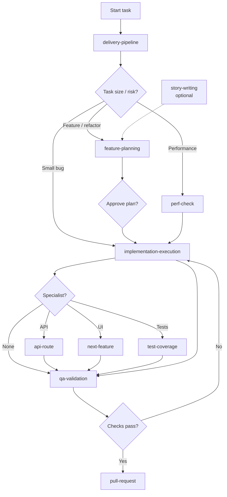

# Next.js Agentic Starter

Production-ready Next.js starter with TypeScript, strong testing defaults, and an agent-first delivery workflow.

## Available Features
- Next.js App Router foundation with TypeScript-first modules.
- Built-in quality gates: lint, typecheck, unit, integration, coverage, and e2e tests.
- Documentation set for architecture, dev workflow, troubleshooting, and releases.
- Agent operating contract in `AGENTS.md` for safe, predictable coding changes.
- Project-local Cursor skills in `.cursor/skills` routed through `delivery-pipeline`.

## Run the Application
- Install dependencies: `npm install`
- Start development server: `npm run dev`
- Build production assets: `npm run build`
- Start production server: `npm run start`

## Quality Checks
- Lint: `npm run lint`
- Type check: `npm run typecheck`
- Unit + integration tests: `npm run test`
- Integration only: `npm run test:integration`
- Coverage (overall): `npm run test:coverage`
- Coverage (changed `src/lib` files): `npm run test:coverage:changed`
- E2E tests: `npm run test:e2e`

Overall coverage % is the **`All files`** row in the terminal table. Open `coverage/index.html` for per-file detail.

## Agentic Workflow (Recommended)

Start every non-trivial task with **`delivery-pipeline`**. It triages the request, runs one phase at a time, and stops for your approval before each handoff.

```text
Use the delivery-pipeline skill.
Task: <describe request>
Constraints: <optional>
Start at the correct phase, run one phase only, then stop for my approval.
```

### Pipeline flow



### Skills

| Skill | Role |
|---|---|
| `delivery-pipeline` | Delivery pipeline lead (start here) |
| `feature-planning` | Scope, acceptance criteria, risks, test strategy |
| `implementation-execution` | Focused implementation |
| `qa-validation` | Acceptance checks and merge readiness |
| `story-writing` | Optional pre-planning (standalone, not in pipeline) |
| `next-feature` | App Router UI work |
| `api-route` | API endpoints with validation and tests |
| `test-coverage` | Targeted test and coverage expansion |
| `perf-check` | Production-mode performance investigation |
| `pull-request` | Open GitHub PR after QA (on request) |

### Skill-to-task quick guide
- BA-ready feature: `delivery-pipeline` → plan → implement → QA
- Missing acceptance criteria: `story-writing` first, then `delivery-pipeline`
- API change: add `api-route` during implementation
- Low test confidence: add `test-coverage` before QA
- Slow page/route: `perf-check` with production-mode measurements

Full prompts and handoff template: `.cursor/skills/README.md`

## Project Docs
- Architecture: `docs/architecture.md`
- Development workflow: `docs/development-workflow.md`
- Troubleshooting: `docs/troubleshooting.md`
- Release process: `docs/release-process.md`
- Agent contract: `AGENTS.md`
- Project skill docs: `.cursor/skills/README.md`

## AI Tooling Notes
- `.cursor/` contains Cursor-native rules and skills. Keep it if you use Cursor workflows.
- `orchestration` is a deprecated alias for `delivery-pipeline`.
- Shared docs like `AGENTS.md` and `README.md` are the main cross-tool references.
