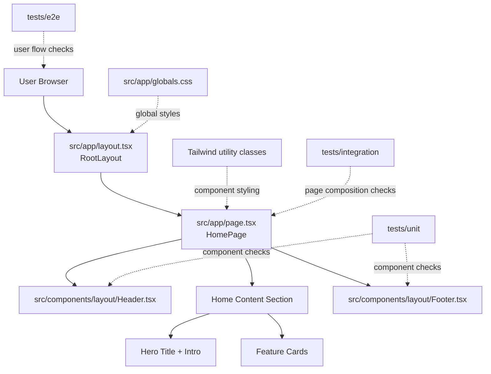

# Architecture

## Target
Single Next.js application repository using npm, with clear boundaries in `src/`.

## Diagram


Fallback (for Markdown viewers without Mermaid support):
```text
User Browser
|
+-- src/app/layout.tsx (RootLayout)
|   |
|   +-- src/app/page.tsx (HomePage composition)
|       |
|       +-- src/components/layout/Header.tsx
|       +-- Home content section (hero + feature cards)
|       +-- src/components/layout/Footer.tsx
|
+-- Styling
|   +-- src/app/globals.css (global styles)
|   +-- Tailwind utility classes (component/page-level styles)
|
+-- Tests
    +-- tests/unit (header/footer component checks)
    +-- tests/integration (page composition checks)
    +-- tests/e2e (user-visible flow checks)
```

## Layers
- `src/app`: route-level composition and app shell (`layout.tsx`, `page.tsx`)
- `src/components/layout`: reusable layout primitives (`Header`, `Footer`)
- `src/app/globals.css`: global style foundation
- Tailwind utility classes: page/component styling at the usage site
- `tests/unit`, `tests/integration`, `tests/e2e`: layered UI quality checks

## UI and Test Organization
- Use PascalCase component files, such as `Header.tsx` and `Footer.tsx`.
- Group reusable components by domain (`layout`, then feature domains as they grow).
- Keep test folders mirrored to source structure under `tests/unit` where possible.
- Prefer `index.ts` barrel exports inside component domains for cleaner imports.

## Quality Baseline
- Linting + formatting + type checking
- Unit/integration tests plus e2e placeholders
- CI gates for pull requests
