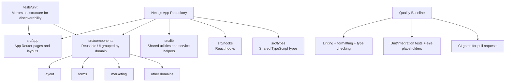

# Architecture

## Target
Single Next.js application repository using npm, with clear boundaries in `src/`.

## Diagram


Fallback (for Markdown viewers without Mermaid support):
```text
Next.js App Repository
|
+-- src/app (App Router pages and layouts)
|
+-- src/components (Reusable UI grouped by domain)
|   |
|   +-- layout
|   +-- forms
|   +-- marketing
|   +-- other domains
|
+-- src/lib (Shared utilities and service helpers)
+-- src/hooks (React hooks)
+-- src/types (Shared TypeScript types)
|
+-- tests/unit (Mirrors src structure for discoverability)
|
+-- Quality Baseline
    +-- Linting + formatting + type checking
    +-- Unit/integration tests + e2e placeholders
    +-- CI gates for pull requests
```

## Layers
- `src/app`: Next.js App Router pages and layouts
- `src/components`: reusable UI components grouped by domain (example: `src/components/layout`)
- `src/lib`: shared utilities and service helpers
- `src/hooks`: React hooks
- `src/types`: shared TypeScript types

## UI and Test Organization
- Use PascalCase component files, such as `Header.tsx` and `Footer.tsx`.
- Group components by feature or domain (`layout`, `forms`, `marketing`, etc.).
- Keep test folders mirrored to source structure under `tests/unit` for discoverability.
- Prefer `index.ts` barrel exports inside component domains for cleaner imports.

## Quality Baseline
- Linting + formatting + type checking
- Unit/integration tests plus e2e placeholders
- CI gates for pull requests
