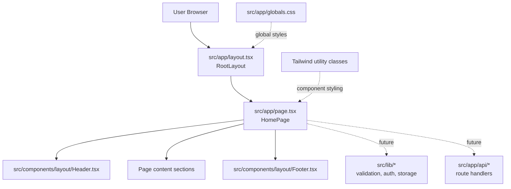
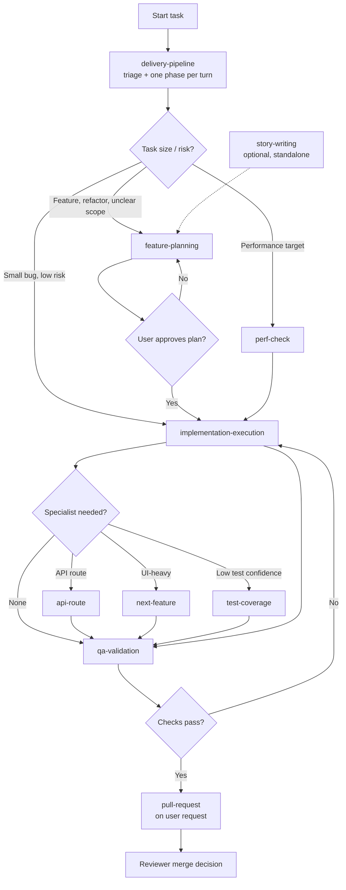
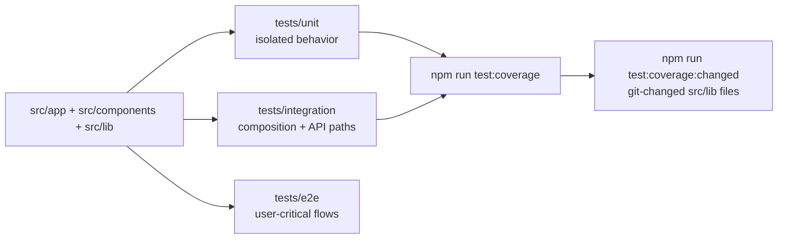

# Architecture

## System Overview

This repository is a single Next.js application with two coordinated architecture layers:

1. **Application runtime** — routes, components, shared logic, and APIs under `src/`.
2. **Delivery and quality** — agent skills, docs, and quality gates that govern how changes are planned, implemented, and validated.

Both layers are documented here because the starter is designed for agent-assisted delivery, not only for UI composition.

## Application Runtime

### Layers

| Layer | Path | Responsibility |
|---|---|---|
| App Router shell | `src/app` | Route-level composition, metadata, global styles |
| UI components | `src/components` | Reusable UI grouped by domain (`layout`, feature folders as they grow) |
| Shared logic | `src/lib` | Validation, auth, storage, and other testable modules |
| API routes | `src/app/api` | Server endpoints with input validation and consistent error responses |

### Application Diagram


```mermaid
flowchart TD
    Browser[User Browser] --> Layout[src/app/layout.tsx<br/>RootLayout]
    Layout --> Page[src/app/page.tsx<br/>HomePage]

    Page --> Header[src/components/layout/Header.tsx]
    Page --> Content[Page content sections]
    Page --> Footer[src/components/layout/Footer.tsx]

    Page -.future.-> Lib[src/lib/*<br/>validation, auth, storage]
    Page -.future.-> API[src/app/api/*<br/>route handlers]

    Globals[src/app/globals.css] -.global styles.-> Layout
    Tailwind[Tailwind utility classes] -.component styling.-> Page
```

Fallback:
```text
User Browser
|
+-- src/app/layout.tsx (RootLayout)
|   |
|   +-- src/app/page.tsx (HomePage)
|       |
|       +-- src/components/layout/Header.tsx
|       +-- page content sections
|       +-- src/components/layout/Footer.tsx
|
+-- Shared modules (as features grow)
|   +-- src/lib/* (validation, auth, storage)
|   +-- src/app/api/* (route handlers)
|
+-- Styling
    +-- src/app/globals.css
    +-- Tailwind utility classes
```

### UI and Module Conventions

- Use PascalCase component files (`Header.tsx`, `Footer.tsx`).
- Group reusable components by domain under `src/components`.
- Keep server/client boundaries explicit in App Router modules.
- Mirror source structure under `tests/unit` where practical.
- Prefer `index.ts` barrel exports inside component domains.

### Extension Points

| Need | Where to add | Specialist skill |
|---|---|---|
| New page or UI feature | `src/app`, `src/components` | `next-feature` |
| New API endpoint | `src/app/api` | `api-route` |
| Shared business logic | `src/lib` | `implementation-execution` + `test-coverage` |
| Performance work | affected route/page | `perf-check` |

## Delivery and Quality Architecture

Engineering work is routed through **`delivery-pipeline`**, which triages the task, runs one phase per turn, and stops for approval at each handoff.

Canonical skill reference: `.cursor/skills/delivery-pipeline/SKILL.md`

### Delivery Pipeline Diagram


```mermaid
flowchart TD
    Start[Start task] --> DP[delivery-pipeline<br/>triage + one phase per turn]

    DP --> Size{Task size / risk?}
    Size -->|Small bug, low risk| IE[implementation-execution]
    Size -->|Feature, refactor, unclear scope| FP[feature-planning]
    Size -->|Performance target| PC[perf-check]

    SW[story-writing<br/>optional, standalone] -.-> FP

    FP --> Gate1{User approves plan?}
    Gate1 -->|No| FP
    Gate1 -->|Yes| IE

    PC --> IE

    IE --> Spec{Specialist needed?}
    Spec -->|API route| AR[api-route]
    Spec -->|UI-heavy| NF[next-feature]
    Spec -->|Low test confidence| TC[test-coverage]
    Spec -->|None| QA

    AR --> QA[qa-validation]
    NF --> QA
    TC --> QA
    IE --> QA

    QA --> Gate2{Checks pass?}
    Gate2 -->|No| IE
    Gate2 -->|Yes| PR[pull-request<br/>on user request]

    PR --> Review[Reviewer merge decision]
```

### Operating System for Agents

| Artifact | Role |
|---|---|
| `.cursor/skills/` | Phase and specialist workflows |
| `AGENTS.md` | Cross-tool agent contract and quality gates |
| `.cursor/rules/` | Persistent coding, security, and testing policies |
| `docs/` | Human-readable workflow, release, and troubleshooting guides |

### Handoff Protocol

Each phase ends with a structured handoff block (planning, implementation, or qa) before advancing. See `.cursor/skills/README.md` for the template.

## Testing Architecture


```mermaid
flowchart LR
    SRC[src/app + src/components + src/lib] --> Unit[tests/unit<br/>isolated behavior]
    SRC --> Integration[tests/integration<br/>composition + API paths]
    SRC --> E2E[tests/e2e<br/>user-critical flows]

    Unit --> Coverage[npm run test:coverage]
    Integration --> Coverage
    Coverage --> Changed[npm run test:coverage:changed<br/>git-changed src/lib files]
```

| Suite | Location | Purpose |
|---|---|---|
| Unit | `tests/unit` | Components, layouts, and `src/lib` utilities |
| Integration | `tests/integration` | Page composition and API route behavior |
| E2E | `tests/e2e` | Browser-level user flows |

Coverage is scoped to `src/**/*` in `vitest.config.ts`. The overall percentage is the **`All files`** row in the terminal report. HTML detail is written to `coverage/index.html`.

## Quality Baseline

Canonical commands (see `AGENTS.md`):

- `npm run typecheck`
- `npm run test`
- `npm run test:coverage` (overall) or `npm run test:coverage:changed` (when `src/lib` changes)
- `npm run test:e2e` (when user-critical flows change)
- `npm run lint` (when lint setup is functional)

CI and pull request checks should align with these gates.
