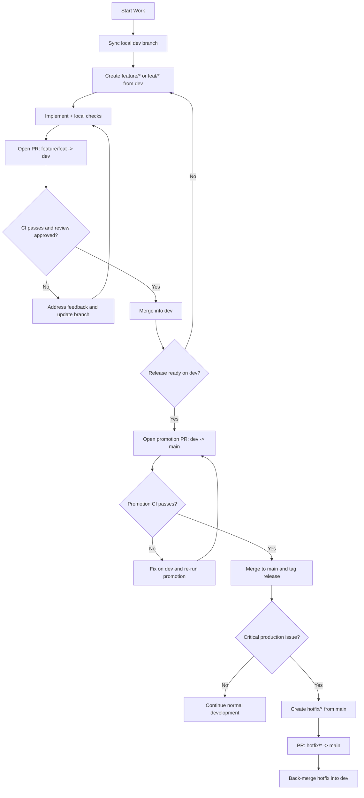
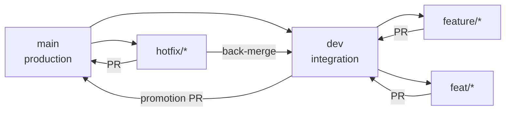

# Development Workflow

## Running the Application
- Start local development server with `npm run app:dev`
- Build production assets with `npm run app:build`
- Start production server (after build) with `npm run app:start`

## Branching
- Keep `main` as production-ready branch.
- Use `dev` as the integration branch for active development.
- Create feature branches from `dev` (examples: `feature/profile-photo-upload`, `feat/profile-photo-upload`).
- Open pull requests from `feature/*` or `feat/*` -> `dev`.
- After validation/stabilization on `dev`, promote with `dev` -> `main`.
- Keep pull requests focused and small.

## Branching Flow


## Branch Topology Chart
Note: This chart shows branch relationships only; merge/release decision logic is defined in **Branching Flow** above.


Fallback:
```text
Start work
  -> sync local dev branch
  -> create feature/* or feat/* from dev
  -> implement + run local checks
  -> PR: feature/feat -> dev
  -> if CI/review fails, fix and re-push
  -> merge to dev when green
  -> if release ready, PR: dev -> main
  -> if promotion CI fails, fix on dev and retry
  -> merge to main and tag release

If critical production issue:
  -> create hotfix/* from main
  -> PR hotfix/* -> main
  -> back-merge hotfix to dev
```

## Local Checks
- Run lint and type checks before pushing
- Run relevant tests before opening a pull request
- Keep unit tests in `tests/unit` mirroring `src` structure
- Name test files as `<ComponentOrPage>.test.tsx` for UI test suites
- Run integration coverage with `npm run test:integration`
- Run browser e2e checks with `npm run test:e2e`

## Pull Requests
- Use the PR template
- Default target branch for feature work is `dev`
- Ensure CI passes before merge
